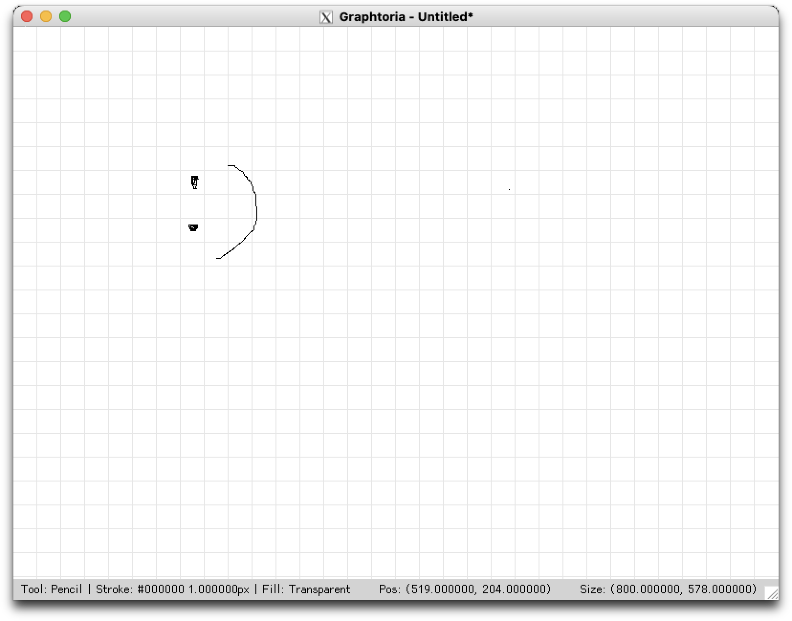

# Graphtoria

Graphtoria 是以 C++17、OpenGL 與 FreeGLUT 製作的桌面繪圖程式，也是電腦圖學課程的作業專案。專案沒有使用現成 GUI framework，而是自行實作視窗元件、事件傳遞、繪圖工具、文字渲染、命令歷史與文件儲存。



## 功能特色

- 繪製點、自由路徑、直線、矩形、橢圓與多邊形
- 插入英文與中文文字
- 選取最上層物件並刪除
- 設定線寬、點大小、線段接合方式與端點樣式
- 支援輪廓、填滿與進階填色模式
- 使用預設色彩或自訂顏色
- 復原、重做與未儲存狀態追蹤
- 線格、點格與無格線顯示模式
- 同時開啟多個繪圖視窗
- 儲存與載入 `.gpt` 專案文件
- 將畫布輸出為 PPM P6 圖片

## 建置需求

- 支援 C++17 的編譯器
- CMake 3.16 以上
- OpenGL
- GLU
- FreeGLUT
- macOS 另外需要 `pkg-config`

### macOS

使用 Homebrew 安裝相依套件：

```bash
brew install cmake pkg-config mesa freeglut
```

### Ubuntu／Debian

```bash
sudo apt update
sudo apt install build-essential cmake libgl1-mesa-dev libglu1-mesa-dev freeglut3-dev
```

Windows 可使用 MinGW-w64 或其他支援 CMake 的 C++ 工具鏈，並準備 OpenGL、GLU 與 FreeGLUT 開發套件。

## 建置與執行

在專案根目錄執行：

```bash
cmake -S . -B build -DCMAKE_BUILD_TYPE=Release
cmake --build build
./build/graphtoria
```

Windows 的執行檔通常位於 `build/graphtoria.exe`；使用多組態產生器時，可能位於 `build/Release/graphtoria.exe`。

建置完成後，CMake 會將 `assets` 複製到執行檔旁。執行程式時必須保留該目錄，否則內附的 GFNT 字型無法載入。

## 基本操作

在畫布上按滑鼠右鍵即可開啟主選單。工具、線條、填色、點大小、文字樣式、格線與檔案操作都能從這裡設定。

- 使用滑鼠左鍵點擊或拖曳進行繪圖。
- 直線工具按住 `Shift` 時，會限制為水平、垂直或 45 度方向。
- 矩形與橢圓工具按住 `Shift` 時，會繪製正方形或正圓。
- 多邊形工具以單擊加入頂點，雙擊或按 `Enter` 完成。
- 繪製多邊形時，`Backspace` 可移除上一個頂點，`Esc` 可取消。
- 文字工具會在點擊畫布後開啟輸入視窗。
- 選取工具會優先選到視覺上最上層的物件；按 `Delete` 或 `Backspace` 刪除，按 `Esc` 取消選取。
- 狀態列會顯示目前工具、樣式、游標位置與畫布大小。

### 快捷鍵

下表的 `Primary` 在 macOS 代表 `Command`，其他平台通常代表 `Ctrl`。

| 快捷鍵                | 功能                          |
| --------------------- | ----------------------------- |
| `Primary + Z`         | 復原                          |
| `Primary + Shift + Z` | 重做                          |
| `Primary + N`         | 新增文件                      |
| `Primary + Shift + N` | 新增視窗                      |
| `Primary + O`         | 開啟文件                      |
| `Primary + S`         | 儲存                          |
| `Primary + Shift + S` | 另存新檔                      |
| `Primary + E`         | 輸出 PPM 圖片                 |
| `Primary + R`         | 重新整理畫面並重設輸入狀態    |
| `C`                   | 清空畫布                      |
| `G`                   | 循環切換線格、點格與無格線    |
| `0`                   | 選取工具                      |
| `1`                   | 鉛筆工具                      |
| `2`                   | 直線工具                      |
| `3`                   | 矩形工具                      |
| `4`                   | 橢圓工具                      |
| `5`                   | 多邊形工具                    |
| `6`                   | 文字工具                      |
| `[` / `]`             | 將線寬與點大小減少／增加 1 px |
| `Shift` + `[` / `]`   | 將線寬與點大小減少／增加 5 px |

點工具目前只能從右鍵選單的 `Tools > Point` 選取。

## 文件與圖片格式

### `.gpt` 專案文件

Graphtoria 使用自行設計的 GPTD V1 格式保存可再次編輯的文件。檔頭為：

```text
GPTD 1
```

文件會保存：

- 畫布尺寸
- 場景物件及其前後順序
- 圖形種類與幾何資料
- 線條、填色、點大小與自訂 RGBA 顏色
- 字型、文字樣式與 UTF-8 文字內容

檔名、復原／重做歷史、目前工具、選取狀態、格線與視窗狀態不會寫入文件。完整格式定義請參考 [GPTD V1 文件格式](docs/gpt_file_format.md)。

### PPM 圖片

輸出功能會將畫布內容寫成二進位 PPM P6 圖片。輸出結果只包含場景，不包含格線、狀態列或其他 UI 元件。

## 字型

文字工具支援三類字型：

- FreeGLUT bitmap fonts
- FreeGLUT stroke fonts
- 專案內附的 GFNT 點陣字型：Cubic 11 與 Unifont 16

GFNT 字型可顯示中文，檔案由程式在執行時從 `assets/fonts` 載入。相關授權文件位於：

- `assets/fonts/Cubic-11/OFL.txt`
- `assets/fonts/unifont/OFL-1.1.txt`

## 程式架構

```text
src/
├── app/          # 應用程式、文件模型與各種視窗
├── command/      # 命令歷史、復原／重做與檔案命令
├── common/       # 顏色、座標、字型與 UTF-8 支援
├── drawing/      # 場景物件、圖形樣式與繪圖工具
├── event/        # 滑鼠、鍵盤與文字輸入事件
├── input/        # 輸入狀態與快捷鍵
├── io/           # 文件 IO、序列化器與圖片輸出
├── render/       # 場景、文字、UI 與 framebuffer 渲染
└── ui/           # 視窗系統、選單、版面配置與 UI 元件
```

文件儲存刻意分成兩層：

- `DocumentStorage` 只負責開啟、讀取與寫入檔案。
- `GptdSerializer` 選擇 GPTD 格式版本，再交給 `GptdParserV1` 或 `GptdDumperV1` 處理內容。

解析器共用的文字記錄、行號、數值與 UTF-8 payload 處理由 `TextParser` 提供；無狀態的小型轉換函式則集中在 serializer utils。

## 已知限制

- 選取工具目前只支援單一物件選取與刪除，尚未支援移動、縮放或多選。
- 圖片只能輸出為 PPM，尚未支援 PNG、JPEG 等常見格式。
- `.gpt` V1 採嚴格解析，不接受未知欄位或其他版本的文件。
